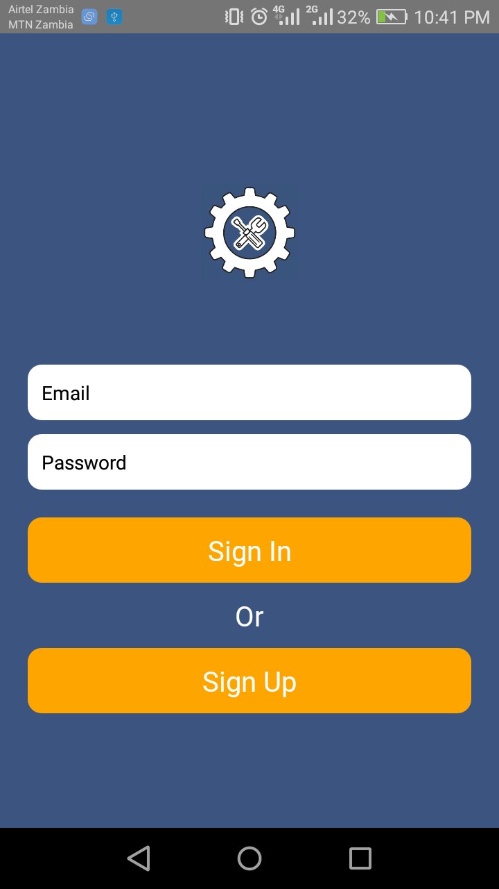
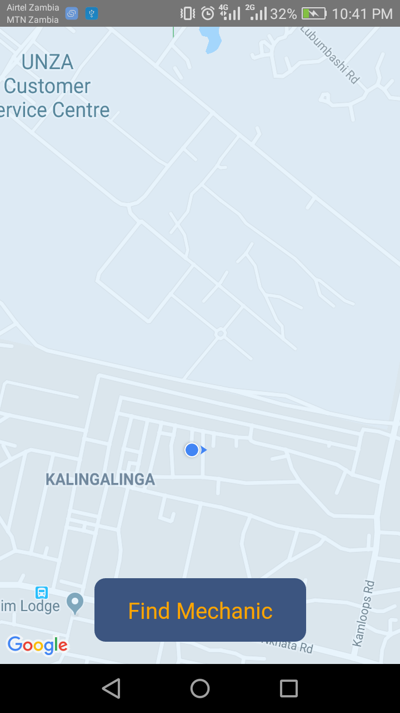

# Mobile Auto Repair
- This is a Mobile app that gives motorists access to the nearest Mechanics on the platform
## Tech Used
- React Native
- Express
- MongoDB
- Web Sockets
## How to run
- clone the repo
- cd express-server && nodemon
- cd sockect.io-server && nodemon
- cd client && npm install
- ```yarn run start```
- ```react-native run-android```
## Login Page

## Motorist Home Page

